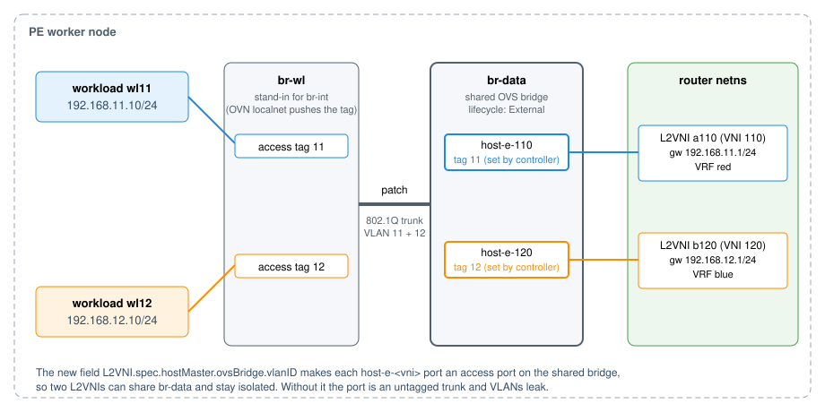

# Access VLAN for the OVS host bridge port — test results

This branch adds `L2VNI.spec.hostMaster.ovsBridge.vlanID`. When set, OpenPERouter makes the
L2VNI's `host-e-<vni>` port an access port with that VLAN on an existing (lifecycle `External`) OVS
bridge. The use case is a shared host bridge carrying several networks as VLANs, for example an
OVN-Kubernetes localnet network, whose frames leave `br-int` tagged over a trunking patch port.

It is the "VLAN switching on the host bridge, managed by OpenPERouter" alternative discussed in
openperouter#783, implemented and tested. This directory is a results summary for discussion and
is not meant to be merged.

## What the change does

- A new port is **inserted already tagged**, with the tag and an ownership marker in the same
  OVSDB transaction, so there is no untagged moment.
- Setting the field on an existing port makes it `vlan_mode=access`. The previous mode is recorded
  and restored when the field is removed.
- Removing the field clears the tag only if it still equals the value OpenPERouter set, so a tag
  set by someone else is left alone.
- A same-named port on a different bridge is an explicit error, not a second attachment.
- Writes are one transaction guarded by an OVSDB `wait` on the observed tag, mode and
  `external_ids`, using key-scoped map mutations, with a bounded retry. Two writers cannot
  overwrite each other.

## Test topology

Two L2VNIs in two VRFs (`a110`/VNI 110/VLAN 11 and `b120`/VNI 120/VLAN 12) share one pre-existing
bridge `br-data`. A second bridge `br-wl` stands in for `br-int`: its access ports tag the
workloads' frames, and a patch port trunks VLAN 11 and 12 into `br-data`, which is the same input a
localnet network presents. The workloads are network namespaces with a veth. The L2VNIs sit in
different VRFs so that the isolation check tests L2, not routing.

Environment: a kind cluster (one control plane, one worker), userspace (netdev) OVS, a dummy
underlay interface.

## Results: 25 of 27 checks pass

| Step | Result | Timing |
|---|---|---|
| Create with `vlanID` 11 and 12 | Each port row is inserted with its tag and marker in one transaction (OVSDB monitor shows one `insert` each). No untagged moment. | tag present 1.3 s / 1.8 s after apply |
| VLAN 11, both directions | workload → gateway and VRF → workload: pass | |
| VLAN 12, both directions | pass | |
| Isolation | No answer across VLANs. Each router bridge learns only its own workload's MAC. tcpdump shows no frames from the other VLAN and no 802.1Q frames on the veths. `ofproto/trace`: VLAN 11 → `pop_vlan` to host-e-110 only; VLAN 12 → host-e-120 only. | |
| Router pod restart | Tags kept, traffic passes, 0 lost probes | new pod Ready 12.8 s |
| Remove the field on `a110` | Tag and marker removed; `b120` unaffected. VLAN 11 traffic stops, and the now-untagged trunk port receives VLAN 12 broadcasts, which is the leak the field prevents. | tag cleared 0.81 s after the patch |
| Set it back | Tag and marker restored, traffic passes | tag after 0.83 s, first reply after 1.0 s |
| Forced veth re-creation (named netns and devices deleted, pod deleted) | Tags stay correct on the port rows: pass. **Traffic does not resume: 2 fail.** | pod Ready 14.9 s |

### The two failures

After the veths are re-created with new ifindexes, the OVS port rows survive with the right tags,
and ARP replies reach the port, but they never reach the workload. `ovs-vsctl del-port` on the
port, followed by any L2VNI change, fixes it: the controller re-creates the port, tagged, in 1.1 s.
This points at userspace-datapath OVS keeping a port row across the deletion and re-creation of a
same-named netdev. The tag itself is right throughout. The kernel datapath was not tested, and it
was not established whether an untagged port shows the same behaviour. The code path that keeps an
existing row is unchanged by this branch.

## Unit and root tests

- Unit, conversion and CRD schema tests pass. Results match `main` except a pre-existing
  environment failure in `internal/frrconfig`, identical on both.
- Root-only `internal/hostnetwork` suites: 74 of 74 pass, including a trunk-port case and a
  concurrent-writer case that fails when the OVSDB `wait` guard is removed.
- An e2e spec in upstream's framework, `e2etests/tests/evpn_l2_ovs_vlan.go`, performs the same
  steps. It compiles and passes `gofmt`, but has not been run in the project's devenv.

## Not covered

- Traffic across VXLAN to a remote VTEP (the run had no underlay peer).
- Kernel-datapath OVS.
- Real OVN-Kubernetes pods on a localnet network attachment (stand-in as above).
- IPv6.
